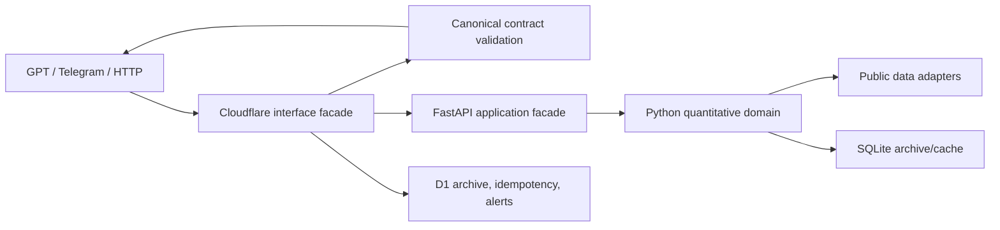

# Architecture

## Scope and safety boundary

MDL Bitcoin Analyst is a probabilistic BTC research system. It has no execution authority. Live trading is absent from the runtime; paper records are explicitly `mock_paper`. The architecture is being migrated progressively because the current Python API and Worker remain large compatibility façades.

## Target layers

1. **Interface:** GPT Action, Telegram, HTTP clients and dashboard. These consume contracts and never contain quantitative truth.
2. **Application:** use cases for quick/deep analysis, archive retrieval, comparisons, alerts and mock paper journals.
3. **Domain:** distributions, risk, regimes, backtests, calibration, confidence and policy invariants.
4. **Adapters:** Bitget public market data, macro/fundamental sources, SQLite, D1, Telegram, Render and Cloudflare.
5. **Infrastructure:** FastAPI, Worker runtime, scheduled monitoring, CI and deployment manifests.

## Authoritative truth

- Quantitative calculations: Python modules under `src/`; the Worker `quant-lite` implementation is a compatibility/edge fallback and must declare its runtime.
- External contract: `contracts/analysis.schema.json` and `contracts/error.schema.json`.
- GPT contract: `gpt/actions/openapi.yaml` and `gpt/instructions/quant_btc_analyst.system.md`.
- Data status vocabulary: `real`, `inferred`, `absent`, `mock`, `mock_paper`, `unknown`, `stale`, `ambiguous_status`.
- Policy: `user_effect=information_only`, `execution_authority=none`, `financial_advice=false`, `paper_trading=mock_only`, `live_trading=blocked`.

Legacy response fields and OpenAPI files remain readable during migration, but they are not authoritative.

## Main flows

**Quick/deep analysis:** interface validates request → rate/auth gates → Worker forwards a bounded authenticated request → FastAPI takes one shared spot snapshot → Python runs horizon frames → invariant validation → archive → canonical adapter → response.

**Archive read:** client sends GET → storage lookup only → compatibility adapter → canonical response. No model run or state change may happen on GET.

**Telegram:** Telegram secret header → bounded JSON → persistent `update_id` deduplication → owner chat allowlist → read command or explicit mock-paper mutation → chunked delivery with 429 handling.

## Current migration seams

- `api_server.py` and `cloudflare-worker/src/index.ts` are retained façades. New contract and security code lives in small modules and is tested independently.
- Historical SQLite/D1 status strings are normalized on read; destructive rewriting is deferred.
- Old GPT schemas are classified as legacy rather than silently deleted.
- Worker strategy routes remain compatibility surfaces, but all live execution code and private exchange credentials have been removed.

## Health and observability

`/live` means process reachability. `/ready` validates database/schema/auth configuration. `/health` is a compatibility liveness alias. Logs and metrics must carry a request/run/archive ID and must not contain tokens, client keys, chat IDs or webhook URLs. Readiness is multi-dimensional; a single boolean never authorizes a production release or financial action.
